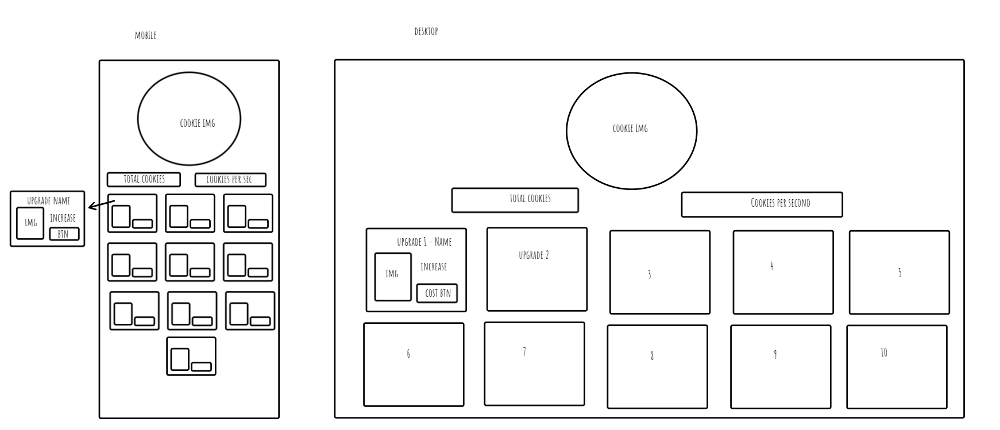

# User Stories

- As a developer, I want the application to use the useState hook so that the user’s interactions with the app are smooth and their data is managed effectively.
- As a developer, I want to use the useEffect hook to manage game time with setInterval, return a cleanup function, and use a dependency array so that the game runs efficiently and updates in real-time for the user.
- As a developer, I want to create separate files that return JSX instead of including all JSX within App.jsx so that the code is well-organized, making the app more maintainable and reliable for the user.
- As a user, I want the application to automatically update the game state every second so that I can see my progress and earned cookies in real-time, making the game more exciting and rewarding.
- As a developer, I want to use the .map() function to render lists of items efficiently so that the user can see dynamic content without performance issues.
- As a user, I want to purchase upgrades with my earned cookies to increase my cookies per second, making the gameplay more rewarding.

# Requirements

- Implement the useState hook.  
  Completed.
- Use useEffect effectively.  
  Used useEffect.
- Return JSX from a source other than App.jsx, for example, by using components.  
  Completed.
- Apply setInterval to execute periodic tasks within the application.  
  Completed.
- Use the .map() function to render lists of items in the application dynamically.  
  Completed.
- Use logic to manage the purchase and application of upgrade items within the game.  
  Completed. If the cookies in state are high enough the purchase options do reduce the number of cookies and increase ccokies per second.

# Reflection

I struggled updating the state of the total cookies and I think this blocked me from using the local storage effectively. I do have some commented out code.  
I also couldn't figure out how to get my upgrades to go into a row. Which container to style to move them all. I did add some media queries but I was hopeful the basics would match my wireframe more before applying those.

Rendered link: https://cookie-clicker-w80b.onrender.com  
 

My MVPs were:

- click to increase cookies button functional
- upgrade purchases displaying
- upgrade purchase buttons working and logic in place (to reduce total cookies and increase cookies per second)
- local storage for total cookies and cookies per second
- media queries

My stretch goals:

- To have the images of the upgrades appear above the list of upgrades (when they are purchased) with a counter of how many are owned next to it.

Resources used:

- https://www.freecodecamp.org/news/how-to-use-localstorage-with-react-hooks-to-set-and-get-items/
- W3 schools - ternary operators
- Peers
- previous class topics
- I made an inital 'To Do' list on trello but I didn't follow up with moving them to 'Doing' and then 'Done'.
